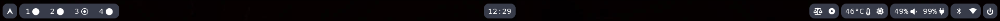

# dotfiles

List of my dot files and config files for my Arch Linux desktop setup.

## Programs

- [Alacritty](https://github.com/alacritty/alacritty): Terminal emulator
- [ClamAV](https://www.clamav.net/): An open-source antivirus engine for detecting trojans, viruses, malwares, etc
- [Fuzzel](https://codeberg.org/dnkl/fuzzel): App launcher
- [Kitty](https://github.com/kovidgoyal/kitty): Terminal emulator
- [Ly](https://github.com/fairyglade/ly): Lightweight TUI (ncurses-like) display manager 
- [Mako](https://github.com/emersion/mako): Wayland notification daemon
- [MPV](https://mpv.io/): MPV is a media player based on MPlayer 
- [Reflector](https://wiki.archlinux.org/title/Reflector): script to weekly update the `/etc/pacman.d/mirrorlist` file
- [Starship](https://github.com/starship/starship): Infinitely customizable prompt for any shell
- [Swappy](https://github.com/jtheoof/swappy): Wayland native snapshot editing tool 
- [Sway](https://github.com/swaywm/sway): i3-compatible Wayland compositor
- [Waybar](https://github.com/Alexays/Waybar): Wayland bar for Sway

## Waybar

  

    With <a href="https://github.com/antimof/UxPlay">uxplay</a>
  

  

  

    With <a href="https://github.com/todotxt/todo.txt-cli">todo.txt</a>
  

  

  

    With <a href="https://github.com/Alexays/Waybar/wiki/Module:-Tray">tray</a>
  

  

  

    With <a href="https://github.com/Alexays/Waybar/wiki/Module:-Hyprland#submap">mode/submap</a>
  

  

